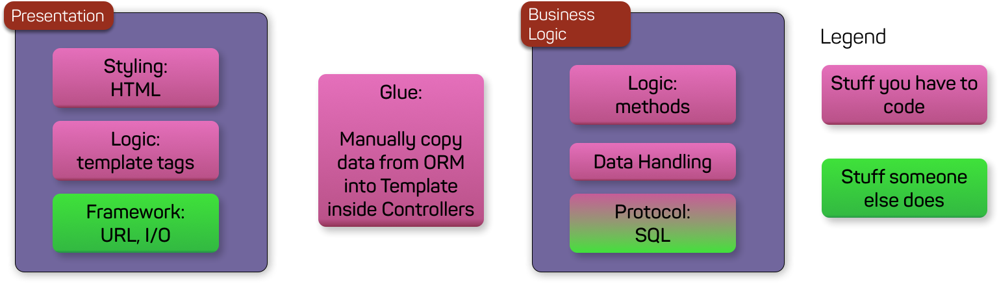
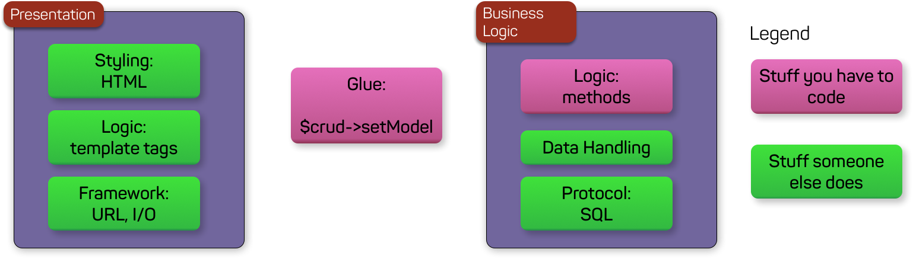
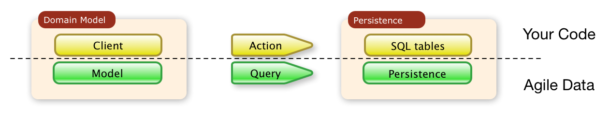
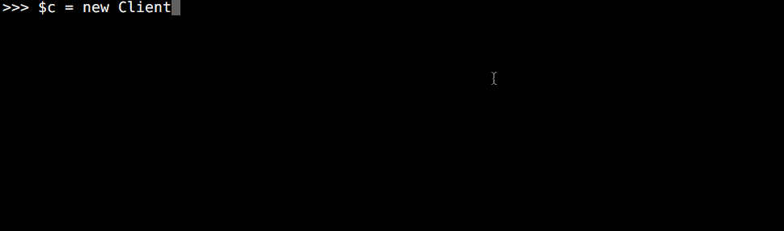
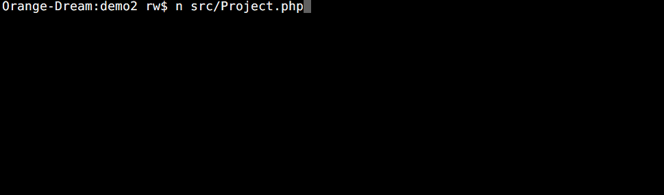
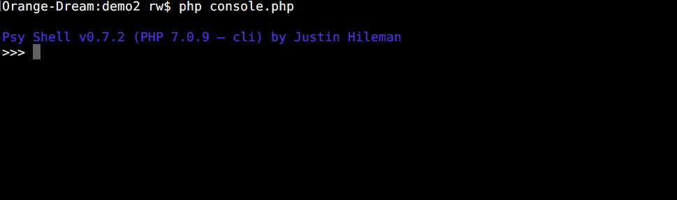
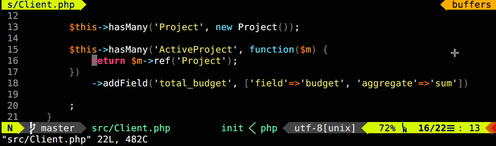

# ATK Data - Data Model Abstraction for Agile Toolkit

[Agile Toolkit](https://atk4.org/) is a Low Code framework written in PHP. Agile UI implement server side rendering engine and over 50 UI generic components for interacting with your Data Model.

Agile Data is a framework for defining your "business layer" which is separate from your "presentation layer" and "persistence". Together with [Agile UI](https://github.com/atk4/ui) you can deliver user interface "out of the box" or with [Agile UI](https://github.com/atk4/api) - general-purpose API endpoints.

- Agile Data uses PHP to define your Business Objects, their properties and actions.
- Agile Data works with SQL, NoSQL or external API sources.
- Agile Data plugs into generic UI components (Crud, Card, Table, Form, etc) with a minimum code.
- Agile Data supports "user actions". UI layer uses "action executor" to read ACL-controlled metadata.
- Agile Data is developer-friendly and easy to learn
- Agile Data is high-performance, capable of abstracting aggregation logic and shifting it into a capable database persistence (such as SQL) through advanced expressions.
- Agile Data is extensible - field types, persistence types, relations and action types can be extended.


[](https://codecov.io/gh/atk4/data)
[](CHANGELOG.md)
[](https://codeclimate.com/github/atk4/data)

Quick-Links: [Documentation](https://atk4-data.readthedocs.io). [Example](https://github.com/atk4/data-primer). [ATK UI](https://github.com/atk4/ui). [Forum](https://forum.agiletoolkit.org/). [Commercial support](https://www.agiletoolkit.org/contact). [Udemy Course](https://www.udemy.com/web-apps-with-php-and-atk/).

## Is ATK Data similar to ORM?

Yes and no.

Agile Data is data persistence framework - like ORM it helps you escape raw SQL. Unlike ORM, it maps objects into "data set" and not "data record". Operating with data sets offers higher level of abstraction:

```php
$vipClientModel = (new Client($db))->addCondition('is_vip', true);

// express total for all VIP client invoices. The value of the variable is an object
$totalDueModel = $vipClientModel->ref('Invoice')->action('fx', ['sum', 'total']);

// single database query is executed here, but not before!
echo $totalDueModel->getOne();
```

In other ORM the similar implementation would be either [slow, clumsy, limited or flawed](https://medium.com/@romaninsh/pragmatic-approach-to-reinventing-orm-d9e1bdc336e3).

## How ATK Data integrates with UI (or API)

Agile Toolkit is a low-code framework. Once you have defined your business object, it can be associated with a UI widget:

```php
Crud::addTo($app)->setModel(new Client($db), ['name', 'surname'], ['edit', 'archive']);
```

or with an API end-point:

```php
$api->rest('/clients', new Client($db));
```

## Extensibility and Add-ons

ATK Data is extensible and offers wide range of add-ons like [Audit](https://github.com/atk4/audit). Developer may also implement advanced DB concepts like "[disjoint subtypes](https://nearly.guru/blog/data/disjoint-subtypes-in-php)" - allowing to efficiently persist object-oriented data in your database.

Regardless of how your model is constructed and what database backend is used, it can easily be used in conjunction with any 3rd party add-on, like [Charts](https://github.com/atk4/chart).

### Benefits of using ATK Data

Designed for medium to large PHP applications and frameworks, ATK Data is a clean implementation of Data Mapper that will:

- Make your application really database-agnostic. SQL? NoSQL? RestAPI? Cache? Load and store your data with any of these, without refactoring your code.
- Execute more on the server. Agile Data converts query logic into server-specific language (e.g. SQL) then delivers you the exact data rows / columns which you need from a single statement, no matter how complex.
- Data architecture transparency. As your database structure change, your application code does not need to be refactored. Replace fields with expressions, denormalize/normalize data, join and merge tables. Only update your application in a single place.
- Extensions. "[Audit](https://github.com/atk4/audit)" - transparently record all edits, updates and deletes with "Undo" support.
- [Out of the box UI](https://github.com/atk4/ui). Who wants to build Admin systems today? Tens of professional components: [Crud](https://ui.atk4.org/demos/crud.php), [Grid](https://ui.atk4.org/demos/grid.php), [Form](https://ui.atk4.org/demos/form3.php) as well as add-ons like [Charts](https://github.com/atk4/chart) can be added to your PHP app with 3-lines of code.
- RestAPI server for Agile Data is currently under development.
- Agile Data and all extensions mentioned above are licensed under MIT and are free to use.

Since the initial introduction of Agile Data back in [2016](https://www.reddit.com/r/PHP/comments/5ftpxg/thank_you_reddit_you_helped_me_create_something/) our group of early-adopters used it in large production PHP projects. **It is time for you to try Agile Data today**.

### Getting Started

Watch [Quick Start](https://atk4-data.readthedocs.io/en/develop/quickstart.html) or [Screencasts](https://www.youtube.com/watch?v=o16xwkFfnuA&t=182s&index=1&list=PLUUKFD-IBZWaaN_CnQuSP0iwWeHJxPXKS). There is also our [Official Udemy Course](https://forum.agiletoolkit.org/t/udemy-com-atk-course-early-access-limited-time-free/413) and [Full Documentation](https://atk4-data.readthedocs.io/) ([PDF](https://atk4-data.readthedocs.io/_/downloads/en/develop/pdf/)).

ATK Data relies on ATK Core and can be greatly complimented by ATK UI:

- [Agile Core](https://atk4-core.readthedocs.io/) - documents various low-level traits and features such as Containers, Hooks or Exceptions ([PDF](https://atk4-core.readthedocs.io/_/downloads/en/develop/pdf/))
- [Agile UI](https://atk4-ui.readthedocs.io/) - documents optional UI components and how to build Web App with them. ([PDF](https://atk4-ui.readthedocs.io/_/downloads/en/develop/pdf/))

## When to use Agile Data?

We believe that as a developer you should spend your time efficiently. Heavy-lifting your data is not efficient. Agile Data enables UI components, exporters, importers or RestAPI servers to be implemented in a **generic** way.

### HTML Applications and Admin Systems

Most of the ORM (including the one you are probably using now) suffer from one flaw. As a framework they do not have enough information to describe models, fields, relations and conditions of your data model.



As a result the UI layer cannot simply discover how your Invoice relate to the Client. This makes YOU write a lot of glue code - performing query and feeding data into the UI layer.

> *With most ORMs you cannot design an generic Crud or Form which would work with ANY model. As a result server-side rendering becoming more extinct in the face of Client-side frameworks.*

Agile Data addresses this balance. For the presentation logic you can use tools such as [Agile UI](https://github.com/atk4/ui), that consists of generic Crud, Form implementations or other modules which accept the Model protocol of Agile Data:

```php
$presentation->setModel($businessModel);
```

This now re-shifts the balance and makes it possible to implement any generic UI Components, that will work with your custom data model and your custom persistence (database).



It's important to note, that glue may also interact with the model preparing it for a specific use-case:

```php
$grid = new \Atk4\Ui\Table();
$data = new Order($db);
$data->addCondition('is_new', true);
$data->addCondition('client_id', $_GET['client_id']);
$grid->setModel($data);

$html = $grid->render();
```

### Domain-Model Reports

Object Oriented approach was designed to hide the complexity of implementation. Yet, every time when you need data for the reports that include aggregation or joins, you must dive deep into your database structure to pull some quirky ORM hack or inject a custom SQL query.

Agile Data was designed in a way where all of your code can rely ONLY on model objects. This includes the reports.

This next example builds a complex "Job Profitability Report" by only relying on Model logic:

```php
class JobReport extends Job
{
    protected function init(): void
    {
        parent::init();

        // Invoice contains Lines that may relevant to this job
        $invoice = new Invoice($this->getPersistence());

        // we need to ignore draft invoices
        $invoice->addCondition('status', '!=', 'draft');

        // each invoice may have multiple lines, which is what we want
        $invoiceLines = $invoice->ref('Lines');

        // build relation between job and invoice line
        $this->hasMany('InvoiceLines', ['model' => $invoiceLines])
            ->addField('invoiced', [
                'aggregate' => 'sum',
                'field' => 'total',
                'type' => 'atk4_money'
            ]);

        // next we need to see how much is reported through timesheets
        $timesheet = new Timesheet($this->getPersistence());

        // timesheet relates to client, import client.hourly_rate as expression
        $timesheet->getReference('client_id')->addField('hourly_rate');

        // calculate timesheet cost expression
        $timesheet->addExpression('cost', ['expr' => '[hours] * [hourly_rate]']);

        // build relation between Job and Timesheets
        $this->hasMany('Timesheets', ['model' => $timesheet])
            ->addField('reported', [
                'aggregate' => 'sum',
                'field' => 'cost',
                'type' => 'atk4_money'
            ]);

        // finally lets calculate profit
        $this->addExpression('profit', ['expr' => '[invoiced] - [reported]']);

        // profit margin could be also useful
        $this->addExpression('profit_margin', ['expr' => 'coalesce([profit] / [invoiced], 0)']);
    }
}
```

Your Report Model:

- moves query logic to the database (SQL)
- is still a model, so compatible with all UI Components and extensions

In order to output results on HTML table:

```php
$grid = new \Atk4\Ui\Grid();
$data = new JobReport($db);
$grid->setModel($data);

$html = $grid->render();
```

Or if you want to display them as a Chart using https://github.com/atk4/chart

```php
$chart = new \Atk4\Chart\BarChart();
$data = new JobReport($db);

// BarChart wants aggregated data
$data->addExpression('month', ['expr' => 'month([date])']);
$aggregate = new AggregateModel($data);
$aggregate->setGroupBy(['month'], [
    'profit_margin' => ['expr' => 'sum'],
]);

// associate presentation with data
$chart->setModel($aggregate, ['month', 'profit_margin']);
$html = $chart->html();
```

In both cases you end up executing **just one** SQL query.

### Large Application and Enterprise use

#### Refactoring

One of the best benefits of Agile Data is ability to refactor database structure in a way which will not impact your application entirely. This severely simplifies your Q/A cycle and reduce cost of application maintenance. As example lets look at the following scenario:

> The existing application calculates the profits based on a SQL formula, but the insane amount of data makes the calculation slow. The solution is to add a "profits" field which value would be automatically updated.

Agile Data gives you all the tools to do this in a few steps:

- Update your Model definition by replacing "expression" with a regular field.
- Create a "migrator" script which calculates expression using [action](https://atk4-data.readthedocs.io/en/develop/quickstart.html#actions).
- Change model behaviors adding Model Hook (afterSave) to re-calculate "profit" within same ACID transaction.

This will not break the rest of your applications - UI, RestAPI or Reports will continue to work, but faster.

#### Audit and Customization

I explain some basic customization in the video: https://www.youtube.com/watch?v=s0Vh_WWtfEs&index=5&list=PLUUKFD-IBZWaaN_CnQuSP0iwWeHJxPXKS

There is also "Advanced Topics" section in the documentation: https://atk4-data.readthedocs.io/en/develop/advanced.html

#### Multi-System Applications

Most SaaS systems have a requirement where user data may not be accessible by other users. Still, the data is stored in the same database and is only distinguished by "system_id" or "user_id" field.

Agile Data has a usage patters that will automatically restrict access by this conditions on all models. This will ensure that currently-logged-in user will be unable to add any data or access any data that does not belong to him even if developer makes a mistake in the code.

#### Migrating from one Database to Another and cross-persistence

With Agile Data you can move your data from one persistence to another seamlessly. If you rely on some feature that your new persistence does not support (e.g. Expression) you can replace them a callback calculation, that executes on your App server.

As usual - the rest of your application is not affected and you can even use multiple types of different persistencies and still navigate through references.

#### Support

Because our team have implemented Agile Data, we have trained experts who can offer commercial consultancy, training and support. Use our Contact form: https://www.agiletoolkit.org/contact for inquiries.

## Framework Integrations

Agile Data (and in some cases Agile UI) have been integrated by community with other popular frameworks:

- Laravel: https://github.com/atk4/laravel-ad
- Wordpress: https://github.com/ibelar/atk-wordpress
- More integrations wanted!

## Q&A

#### Q: I noticed that Agile Data uses sub-selects instead of JOIN. I believe JOIN is more efficient.

While in most cases modern SQL sub-queries have comparable speed to JOIN, Agile Data's SQL persistence also implements "JOIN" support. Use of SubQueries is safer by default because it can imply conditions on a related entity.

You can, however, [import fields through joins too](https://atk4-data.readthedocs.io/en/develop/joins.html)

#### Q: I don't like the `$book->set('field', 123)`, I prefer properties

Agile Models are not Entities. They don't represent a single record, but rather a set of records. Which is why Model has some important properties: `$model->getId()`, `$model->getPersistence()` and `model->getDataRef()`.

Read more on [working with individual data records](https://atk4-data.readthedocs.io/en/develop/persistence.html).

#### Q: I do not like to use class `\Atk4\Data\Model` as a parent

Class `Model` implements a lot of essential functionality. If you need a deeper explanation read my blog post: https://www.agiletoolkit.org/blog/why-should-you-extend-your-entity-class

#### Q: Agile Data has small community

This is something you can change. If you look at the features of Agile Data and believe that it deserves more attention, help us by spreading the word and growing our community.

Agile Data is still relatively new framework and it takes time until PHP community recognizes it.

#### Q: There is broken link / documentation / page

We put all our focus into making a good quality software and give it to you for free. We will try our best to address any broken pages / links or outdated pages, but our resources are limited.

#### Q: Is there training material for Agile Data / Agile UI

We are working on it. For now - visit our [gitter.im](https://gitter.im/atk4/atk4).

#### Q: How can I help / Contribute?

Say hi. We enjoy meeting new people regardless of how good they are with PHP and the framework (https://gitter.im/atk4/atk4).

If you want to help, we have a special tag [Help Wanted](https://github.com/atk4/data/issues?q=is%3Aissue+is%3Aopen+label%3A%22help+wanted%22) in our issue system:

-----------------

some of the information below may be out of date and needs to be cleaned up.

## Agile Data at a Glance

Agile Data implements various advanced database access patterns such as Active Record, Persistence Mapping, Domain Model, Event sourcing, Actions, Hooks, DataSets and Query Building in a **practical way** that can be **easily learned**, used in any framework with SQL or NoSQL database and meeting all **enterprise**-specific requirements.

You get to manipulate your objects first before query is invoked. The next code snippet will work with your existing database of Clients, Orders and Order Lines and will query total amount of all orders placed by VIP clients. Looking at the resulting query you will notice an implementation detail - Line total is not stored physically inside the database but is rather expressed as multiplication of price and quantity:

```php
$m = new Client($db);
echo $m->addCondition('vip', true)
    ->ref('Order')->ref('Line')->action('fx', ['sum', 'total'])->getOne();
```

Resulting Query will always use parametric variables if vendor driver supports them (such as PDO):

```sql
select sum(`price`*`qty`) from `order_line` `O_L` where `order_id` in (
    select `id` from `order` `O` where `client_id` in (
        select `id` from `client` where `vip` = :a
    )
)

// :a is "Y"
```

Agile Data is not only for SQL databases. It can be used anywhere from decoding Form submission data ($_POST) or even work with custom RestAPIs. Zero-configuration implementation for "AuditTrail", "ACL" and "Soft Delete" as well as new features such as "Undo", "Global Scoping" and "Cross-persistence" make your Agile Data code enterprise-ready out of the box.

All of the above does not add complexity to your business logic code. You don't need to create XML, YAML files or annotations. There is no mandatory caching either.

My next example demonstrates how simple and clean your code looks when you store new Order data:

```php
$m = new Client($db);
$m->loadBy('name', 'Pear Company');
$m->ref('Order')
    ->save(['ref' => 'TBL1', 'delivery' => new DateTime('+1 month')])
    ->ref('Lines')->import([
        ['Table', 'category' => 'furniture', 'qty' => 2, 'price' => 10.5],
        ['Chair', 'category' => 'furniture', 'qty' => 10, 'price' => 3.25],
    ]);
```

Resulting queries (I have removed back-ticks and parametric variables for readability) use a consise syntax and demonstrate some of the "behind-the-scenes" logic:

- New order must belong to the Company. Also company must not be soft-deleted.
- `delivery` is stored in field `delivery_date`, also the DateTime type is mapped into SQL-friendly date.
- `order_id` is automatically used with Lines.
- `category_id` can be looked up directly inside the INSERT (standard feature of SQL reference fields).

```sql
select id, name from client where name = 'Pear Company' and is_deleted = 0;
insert into order (company_id, ref, delivery_date)
    values (293, 'TBL1', '2015-18-12');
insert into order_lines (order_id, title, category_id, qty, price) values
    (201, 'Table', (select id from category where name = 'furniture'), 2, 10.5),
    (201, 'Chair', (select id from category where name = 'furniture'), 19, 3.25);
```

If you have enjoyed those examples and would like to try them yourself, continue to https://github.com/atk4/data-primer.

### Introducing Models

Agile Data uses vendor-independent and lightweight `Model` class to describe your business entities:

```php
class Client extends \Atk4\Data\Model
{
    public $table = 'client';

    protected function init(): void
    {
        parent::init();

        $this->addField('name');
        $this->addField('address');

        $this->hasMany('Project', ['model' => [Project::class]]);
    }
}
```

- Documentation: https://atk4-data.readthedocs.io/en/develop/model.html
- Examples: https://github.com/atk4/data-primer/tree/master/src

### Introducing Actions

 

Anything related to a Model (Field, Condition, Reference) is an object that lives in the realm of "Domain Model" inside PHP memory. When you `save()`, frameworks generates an "Action" that will actually update your SQL table, invoke RestAPI request or write that file to disk.

Each persistence implements actions differently. SQL is probably the most full-featured one:



- Documentation: https://atk4-data.readthedocs.io/en/develop/quickstart.html?highlight=action#actions

### Introducing Expressions

Smart Fields in Agile Toolkit are represented as objects. Because of inheritance, Fields can be quite diverse at what they do. For example `SqlExpressionField` can define field through custom SQL or PHP code:



- Documentation: https://atk4-data.readthedocs.io/en/develop/expressions.html

### Introducing References

Foreign keys and Relation are bread and butter of RDBMS. While it makes sense in "Persistence", not all databases support Relations.

Agile Data takes a different approach by introducing "References". It allow you to define relationships between Domain Models that can work with non-relational databases, yet allow you to perform various operations such as importing or aggregating fields. (use of JOIN is explained below)



- Documentation: https://atk4-data.readthedocs.io/en/develop/references.html

### Model Conditions and DataSets

Conditions (or scopes) are rare and optional feature across ORMs but it is one of the most significant features in Agile Data. It allows you to create objects that represent multiple database records without actually loading them.

Once condition is defined, it will appear in actions and will also restrict you from adding non-compliant records.



- Documentation: https://atk4-data.readthedocs.io/en/develop/conditions.html

### Build Reports inside Domain Model

With most frameworks when it comes to serious data aggregation you must make a choice - write in-efficient domain-model code or write RAW SQL query. Agile Data helps you tap into unique features of your DataBase while letting you stay inside Domain Model.

How do we create an efficient query to display total budget from all the projects grouped by client's country while entirely remaining in domain model? One line of code in Agile Data:


Did you notice the query has automatically excluded canceled projects?

### Model-level join

Most ORMs can define models that only work with a single SQL table. If you have
to store logical entity data into multiple tables - tough luck, you'll have to do
some linking yourself.

Agile Data allow you to define multiple joins right inside your model. As you join()
another table, you will be able to import fields from the joined table. If you
create a new record, data will automatically be distributed into the tables and
records will be linked up correctly.


The best part about joins is that you can add them to your existing model for specific queries. Some extensions can even do that.

- Documentation: https://atk4-data.readthedocs.io/en/develop/joins.html

### Deep Model Traversal

Probably one of the best feature of Agile Data is deep traversal. Remember how
your ORM tried to implement various many-to-many relationships? This is no longer
a problem in Agile Data.

Suppose you want to look at all the countries that have 2-letter name. How many
projects are there from the clients that are located in a country with 2-letter name?

Agile Data can answer with a query or with a result.


- Documentation: https://atk4-data.readthedocs.io/en/develop/references.html#traversing-dataset

## Advanced Features and Extensions

The examples you saw so far are only a small fragment of the possibilities you can
achieve with Agile Data. You now have a new playground where you can design your
business logic around the very powerful concepts.

One of the virtues we value the most in Agile Data is ability to abstract and
add higher level features on our solid foundation.

### Explorability

If you pass a `$model` object inside any method, add-on or extension, it's possible for them to discover not only the data, but also field types and various meta-information, references to other models, supported actions and many more.

With that, creating a Dynamic Form UI object that automatically includes Dropdown with list of allowed values is possible.

In fact - we have already stared work on [Agile UI](https://github.com/atk4/ui) project!

### Hooks

You now have a domain-level and persistence-level hooks. With a domain-level ones (afterLoad, beforeSave) you get to operate with your field data before or after an operation.

On other hand you can utilize persistence-level hooks ('beforeUpdateQuery', 'beforeSelectQuery') and you can interact with a powerful Query Builder to add a few SQL options (insert ignore or calc_found_rows)
if you need.

And guess what - should your model be saved into NoSQL database, the domain-level hooks will be executed, but SQL-specific ones will not.

- Documentation: https://atk4-data.readthedocs.io/en/develop/hooks.html

### Extensions

Most ORMs hard-code features like soft-delete, audit-log, timestamps. In Agile Data the implementation of base model is incredibly lightweight and all the necessary features are added through external objects.

We are still working on our Extension library but we plan to include:

- [Audit Log](https://www.agiletoolkit.org/data/extensions/audit) - record all operations in a model (as well as previous field values), offers a reliable Undo functionality.
- ACL - flexible system to restrict access to certain records, fields or models based on
  permissions of your logged-in user or custom logic.
- Filestore - allow you to work with files inside your model. Files are actually
  stored in S3 (or other) but the references and meta-information remains in the database.
- Soft-Delete, purge and undelete - several strategies, custom fields, permissions.

More details on extensions: https://www.agiletoolkit.org/data/extensions

### Performance

If you wonder how those advanced features may impact performance of loading and saving data, there is another pleasant surprise. Loading, saving, iterating and deleting records do not create new in-memory objects:

```php
foreach ($client->ref('Project') as $project) {
    echo $project->get('name') . "\n";
}

// $project refers to same object at all times, but $project's active data
// is re-populated on each iteration
```

Nothing unnecessary is pre-fetched. Only requested columns are queried. Rows are streamed and never ever we will try to squeeze a large collection of IDs into a variable or a query.

Agile Data works fast and efficient even if you have huge amount of records in the database.

### Security

When ORM promise you "security" they don't really extend it to the cases where you wish to perform a sub-query of a sort. Then you have to deal with RAW query components and glue them together yourself.

Agile Data provides a universal support for Expressions and each expression have support for `escaping` and `parameters`. My next example will add scope filtering the countries by their length. Automatic parameters will ensure that any nastiness will be properly escaped:

```php
$country->addCondition($country->expr('length([name]) = []', [$_GET['len']]));
```

Resulting query is:

```php
where length(`name`) = :a
```

Another great security feature is invoked when you try and add a new country:

```php
$country->insert('Latvia');
```

This code will fail, because our earlier condition that "Latvia" does not satisfy. This makes variety of other uses safe:

```php
$client->load(3);
$client->ref('Order')->insert($_POST);
```

Regardless of what's inside the `$_POST`, the new record will have `client_id = 3` .

Finally, the following is also possible:

```php
$client->addCondition('is_vip');
$client->ref('Order')->insert($_POST);
```

Regardless of the content of the POST data, the order can only be created for the VIP client. Even if you perform a multi-row operation such as `action('select')` or `action('fx')` it will only apply to records that match all of the conditions.

Those security measures are there to protect you against human errors. We think that input sanitization is still quite important and you should do that.

## Installing into existing project

Start by installing Agile Data through composer:

```bash
composer require atk4/data
composer g require psy/psysh:@stable # optional, but handy for debugging!
```

Define your first model class:

```php
namespace my;

class User extends \Atk4\Data\Model
{
    public $table = 'user';

    protected function init(): void
    {
        parent::init();

        $this->addField('email');
        $this->addField('name');
        $this->addField('password');

        // add your table fields here
    }
}
```

Next create `console.php`:

```php
<?php

require __DIR__ . '/vendor/autoload.php';

$db = \Atk4\Data\Persistence::connect(PDO_DSN, USER, PASS);
eval(\Psy\sh());
```

Finally, run `console.php`:

```
$ php console.php
```

Now you can explore. Try typing:

```php
> $m = new \my\User($db);
> $m->loadBy('email', 'example@example.com')
> $m->get()
> $m->export(['email', 'name'])
> $m->executeCountQuery()
```

## Agile Core and DSQL

Agile Data relies on DSQL - Query Builder for SQL persistence and multi-record operations though Actions. Various interfaces and PHP patterns are implemented through [Agile Core](https://github.com/atk4/core).

Hold on! Why yet another query builder? Obviously because existing ones are not good enough. You can write multi-vendor queries in PHP profiting from better security, clean syntax and avoid human errors.

DSQL tries to do things differently:

1. Composability. Unlike other libraries, we render queries recursively allowing many levels of sub-selects.
2. Small footprint. We don't duplicate query code for all vendors, instead we use clever templating system.
3. Extensibility. We have 3 different ways to extend DSQL as well as 3rd party vendor driver support.
4. **Any Query** - any query with any complexity can be expressed through DSQL.
5. Almost no dependencies. Use DSQL in any PHP application or framework.
6. NoSQL support. In addition to supporting PDO, DSQL can be extended to deal with SQL-compatible NoSQL servers.

DSQL Is Simple and Powerful

```php
$query = $connection->dsql();
$query->table('employees')
    ->where('birth_date', '1961-05-02')
    ->field('count(*)');
echo 'Employees born on May 2, 1961: ' . $query->getOne();
```

If the basic query is not fun, how about more complex one?

```php
// establish a query looking for a maximum salary
$salary = $connection->dsql();

// create few expression objects
$eMs = $salary->expr('max(salary)');
$eDf = $salary->expr('TimeStampDiff(month, from_date, to_date)');

// configure our basic query
$salary
    ->table('salary')
    ->field(['emp_no', 'max_salary' => $eMs, 'months' => $eDf])
    ->group('emp_no')
    ->order('-max_salary')

// define sub-query for employee "id" with certain birth-date
$employees = $salary->dsql()
    ->table('employees')
    ->where('birth_date', '1961-05-02')
    ->field('emp_no');

// use sub-select to condition salaries
$salary->where('emp_no', $employees);

// join with another table for more data
$salary
    ->join('employees.emp_id', 'emp_id')
    ->field('employees.first_name');

// finally, fetch result
foreach ($salary as $row) {
    echo 'Data: ' . json_encode($row) . "\n";
}
```

This builds and executes a single query that looks like this:

```sql
SELECT
    `emp_no`,
    max(salary) `max_salary`,
    TimeStampDiff(month, from_date, to_date) `months`
FROM
    `salary`
JOIN
    `employees` on `employees`.`emp_id` = `salary`.`emp_id`
WHERE
    `salary`.`emp_no` in(select `id` from `employees` where `birth_date` = :a)
GROUP BY `emp_no`
ORDER BY max_salary desc

:a = "1961-05-02"
```

## UI for Agile Data

In a universe with hundreds of [different PHP Crud implementations](https://codecanyon.net/category/php-scripts?utf8=✓&term=crud&as=0&referrer=search&view=list), we thought you might like to have an open-source Grid/Crud/Forms/Other UI library that is specifically designed for Agile Data.

Please consider our other MIT-licensed project - [Agile UI](https://atk4.org/) to build something like this:


## Community and Support

[](https://gitter.im/atk4/dataset?utm_source=badge&utm_medium=badge&utm_campaign=pr-badge&utm_content=badge)
[](https://stackoverflow.com/questions/ask?tags=atk4)
[](https://forum.agiletoolkit.org/c/44)
