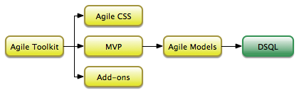

# Agile Data - Domain Model and Persistence library


Most performance problems in apps are due to inefficient use of database access patterns. In practical applications, when developers have a strict deadlines, they make trade-offs that result in poor scalability or poor application design. As a consequences your application may exhibit some of the symptoms:

 1. Your application logic depends on specific table structure (violates SRP). 
 2. Switching from SQL to NoSQL would take some major changes.
 2. You struggle to perform clean unit testing of your business logic actual database.
 3. Your ORM/AR framework uses your database inefficiently producing extra queries or extra data exchange.
 4. In some situations you are forced to write full RAW queries.
 5. You manage "scopes" manually using where() in your presentation logic.
 
The framework that you are using may try to solve few of the listed problem, but often this require trade-off elsewhere.

**Agile Data is a unique library that enforces correct design of Business Logic in your PHP
application and handles persistence (interaction with database) in flexible and scalable way.**


[More information about benefits and comparisons with other patterns/frameworks](https://github.com/atk4/dataset/wiki/USP)


## Introducing the concept

To learn and use Agile Data efficiently, you need to leave behind your prejudice towards some of the data access
patterns and read on how we are improving familiar concepts by implementing them correctly:

 - [Business Models](https://github.com/atk4/dataset/wiki/Business-Models) - Class for implementing your business logic [DM].
 - [Active Record](https://github.com/atk4/dataset/wiki/Active-Record) - Simplified record-based access to your Model data. [DM].
 - [Explicit Loading and Saving](https://github.com/atk4/dataset/wiki/Explicit-Loading-and-Saving) - No auto-load/auto-save. Learn how to access your database data [PM].
 - [Relation Mapping](https://github.com/atk4/dataset/wiki/Relation-Mapping) - Traverse between related business data [DM].
 - [Persistence](https://github.com/atk4/dataset/wiki/Persistence) - Design and tweak how your Business Models are mapped into tables [DM->PM].
 - [Derived Queries](https://github.com/atk4/dataset/wiki/Derived-Queries) - Express your Business Models as SQL queries [PM].
 - [Expressions](https://github.com/atk4/dataset/wiki/Expressions) - Use Derived queries to add fields in your Business Models that are calculated in SQL [PM].
 - [Query Building](https://github.com/atk4/dataset/wiki/Query-Building) - Build an execute complex multi-row queries mapped from your Business Models [PM].
 - [Unit-testing](https://github.com/atk4/dataset/wiki/Unit-Testing) - Business Models can be decoupled from persistence layer for efficient Unit Testing [DM].
 - [Aggregation and Reports](https://github.com/atk4/dataset/wiki/Aggregaation-and-Reports) - Support report generation techniques ndaggregations for your Business models [DM].

We have designed Agile data in a very simple-to-learn way. We seek to educate developers about the correct way to write code through intuitive pattern designs.

We also care about other technicalities, so we will:

 - work with PHP community and discuss main decisions collaboratively. 
 - write short and easy-to-read, standard-compliant code with high code-climate score.
 - unit-test our own code with minimum of 95% code coverage.
 - add code through pull requests and discuss them before merging.
 - never break APIs in minor releases.
 - support composer but include minimum dependencies.
 - be friendly with all higher-level frameworks.
 - avoid database query latency/overheads, pre-fetching or lazy loading.
 - do not duplicate the code (e.g. in vendor drivers)
 - use MIT License
 
## Project Credibility 

A new and "revolutionary" mini-ORM projects come and go every week. Will Agile Data be here in 5 years time?

Yes.

The founder and lead developer for this library is: [Romans Malinovskis](https://www.openhub.net/accounts/romaninsh) who has been a long-time open-source developer and maintainer of Agile Toolkit (PHP UI Framemwork).

Agile Data is inspired by "Model" implementation in Agile Toolkit that Romans [has implemented 2011](https://github.com/atk4/atk4/commit/976ccce73c5c7bf5afbedc70aa3f72158dbf534b#diff-8e1db8ebf3425c345973e98193903012) and has been maintained since. Model implementation of Agile Toolkit has been well received by others and have been used in many production projects for the last 5 years.

This project (Agile Data) is a major rewrite that separates "Models" from the rest of Agile Toolkit. Once stable Agile Toolkit will be refactored to make use of Agile Data ensuring the longevity of this project.



[Frequently Asked Questions](https://github.com/atk4/dataset/wiki/Frequently-Asked-Questions)


## Sample Code

Usage syntax of Agile data is consise and readable. Start by defining your Business Models.

```
class Model_User extends \atk4\data\Model
{
    private $table = 'user';
    function init() {
        parent::init();

        $this->addField('name');
        $this->addField('surname');
        $this->addField('email');

        $this->addField('type')->enum(['client', 'admin']);

        $this->hasMany('Order');
    }
}
```

Link your business model with persistence layer like this. Once linked you can
access records individulaly:

```
$m = $db->add('Model_User');
$m->load(10); // 1-qurey
```

or build SQL queries that affect multiple records:

```
$m->addCondition('email',null)->dsql()->delete(); // 1-query
```

You can traverse individual records:

```
$m = $db->add('Model_User');
$m->load(10); // 1-query

foreach ($m->ref('Order') as $order) {  // 1-query
    // iterate through order of user with id=10
}
```

or the whole data-set:

```
$m = $db->add('Model_User');
$m->addCondition('isOnline', true);

foreach ($m->ref('Order') as $order) {  // 1-query
    // iterate through order of all on-line users
}
```

You can define persistance logic rules for one or multiple databases based on
supported capabilities:

```
class Model_Client extends Model_User
{
    function init() {
        parent::init();
        
        if ($this->connection->supports('expressions')) {
            $this->addExpression('completed_orders')->set(
                $this->ref('Order')
                    ->addCondition('isCompleted',true)
                    ->sum('amount')
            );
        } else {
            $this->addField('completed_orders'); // does not support sub-queries
        }
    }
}
```

and use distinctive logic when using various vendors:

```
class Model_Order extends atk4\data\Model
{
    public $table='order';
    function init() {
        parent::init();

        $this->hasMany('Order_Line');
        $this->hasOne('Client');

        if ($this->connection->supports('expressions')) {
            $this->addExpression('amount')
                ->set($this->ref('Order_Line')->sum('amount'));
        } else {
            $this->addField('amount');
        }
    }
    function complete() {
        $this['isCompleted']=true;
        $this->saveAndUnload();

        if (!$this->connection->supports('expressions')) {
            $this->ref('Client')->incr('completed_orders', $this['amount']);
        }
    }
}
```

N.B. (ABOVE EXAMPLES MIGHT CHANGE AS WE IMPLEMEST THE CODE).


## Current Status

We are currently working on "Concept Design". Feel free to discuss, contribute feedback or follow. 

[Read our Development Wiki](https://github.com/atk4/dataset/wiki).

You can also join us on Gitter to ask questions:

[](https://gitter.im/atk4/dataset?utm_source=badge&utm_medium=badge&utm_campaign=pr-badge&utm_content=badge)

## Roadmap

To implement Agile Data, we had to start from the very beginning.

```
0.1   Finalize concept, api-interface draft and lightweight documentation.
0.2   Implement Active Record with Business Model class.
0.3   Implement SQL persistence mapping - storing and loading records.
0.4   Add support for Conditions to implement DataSet.
0.5   Further integrate with the Query Builder, add Expression support.
0.6   Add relation traversal support.
0.7   Add support for hooks (before/after save) in (DM and PM).
0.8   Add support for dealing with multiple persistences.
0.9   Add support for strong and weak join when persisting.
0.10  Add ability to specify meta-information into fields.
0.11  Add support for derived models (unions).
1.12  Add support for 3rd party vendor implementations.
0.13  Achieve our test coverage, code quality and documentation standards.
1.0   First Stable Release.
1.1   Add support for MongoDB.
1.2   Add support and docs for Validators.
```

## Past Updates

* 17 Apr: Started working on draft concept (in wiki)
* 14 Apr: [Posted my concept on Reddit](https://www.reddit.com/r/PHP/comments/4f2epw/reinventing_the_faulty_orm_concept_subqueries/)


