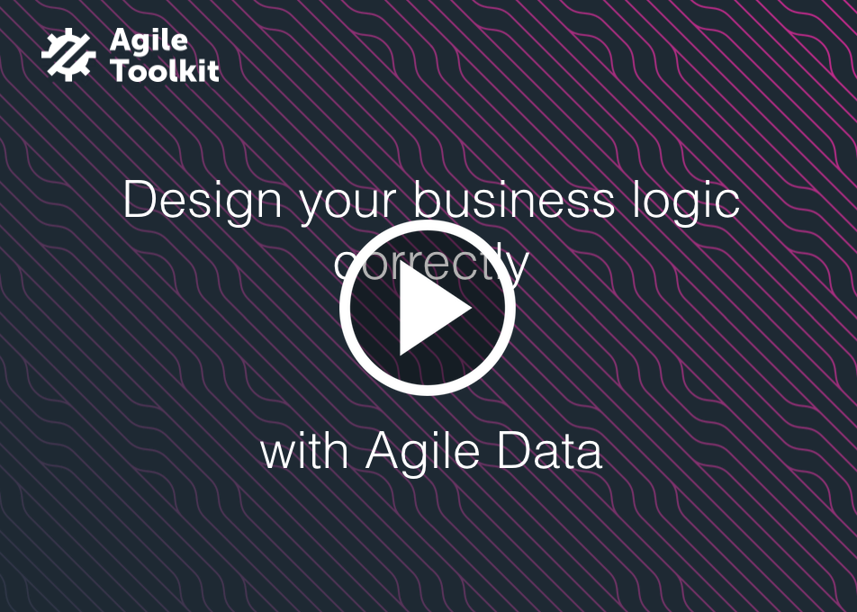

========
Overview
========

Agile Data is a unique SQL/NoSQL access library that promotes correct Business Logic design in
your PHP application and implements database access in a flexible and scalable way.

Simple to learn
===============

We have designed Agile Data to be very friendly for those who started programming recently
and teach them correct patterns through clever architectural design.

Agile Data carries the spirit of PHP language in general and gives developer ability
to make choices. The framework can be beneficial even in small applications, but the
true power can be drawn out of Agile Toolkit.

Fresh Concepts
==============

In common data mapping techniques developer operates with objects that represent
individual entities. Whenever he has to work with multiple records, he is presented with
array of those objects.

Agile Data introduces fresh concept for "DataSet" that represent collection of entities
stored inside a database. A concept of "Action" allows developer to execute operations
that will affect all records in a DataSet.

Separation of Business Logic and Persistence
============================================

We educate developer about separating their Domain logic from persistence following the
best practices of enterprise software. We offer the solution that works really well for
most people and those who have extreme requirements can extend.

For example, you can customize persistence logic of Data Model with your own query logic
where necessary.

Major Databases are Supported
=============================

The classic approach of record mapping puts low requirements on the database, but as
result sacrifice performance. The abstraction of queries leads to your code being reliant
on SQL vendor.

Agile Data introduces concepts that can be implemented across multiple database vendors
regardless of their support for SQL. Agile Data even works with NoSQL databases like MongoDB.

If you use SQL vendor, the standard operations will be more efficient, but if you operate
with a very basic database such as MemCache, then you can still simulate basic functionality.

We make it our goal to define a matrix of basic functionality and extended functionality
and educate developer how to write code that is both high performance and cross-compatible.

Extensibility
=============

Agile Data is designed to be extremely extensive. The framework already includes all the
basic functionality that you would normally need, but there are more awesome things
that are built as extensions:

 - join support - Map your Business Model to multiple tables
 - aggregate models - Build your Report Models on top of Domain models and forget about custom queries
 - more vendors - Add support for more vendors and your existing application code will just work
 - validation - Perform data validation on Domain level

Great for UI Frameworks
=======================

Agile Data does not approach Business Models just as property bags. Each field has some useful
meta-information such as:

 - type
 - caption
 - hint
 - etc

This information is useful if you are using UI framework. `Agile Toolkit <http://agiletoolkit.org/>`_
takes advantage of this information to automatically populate your form / grid fields and is able
to work directly with your models.

