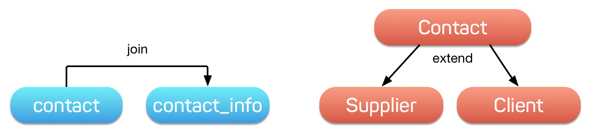

.. _quickstart:

==========
Quickstart
==========

Agile Data Framework is built around some unique concepts. Your knowledge of
other ORM, ActiveRecord and QueryBuilder tools could be helpful, but you should
carefully go through the basics if you want to know how to use Agile Data
efficiently.

The distinctive goal for Agile Data is ability to "execute" complex operations
on the database server directly, such as aggregation, sub-queries, joins and
unions but only if the database server supports those operations.

Developer would normally create a declaration like this::

    $user->hasMany('Order')->addField('total', ['aggregate'=>'sum']);

It is up to Agile Data to decide what's the most efficient way to implement
the aggregation. Currently only SQL persistence is capable of constructing
aggregate sub-query.

Requirements
============

If you wish to try out some examples in this guide, you will need the following:

- PHP 5.6 or above.
- MySQL or MariaDB
- Install `Agile Data Primer <https://github.com/atk4/data-primer/>`_

.. code-block:: bash

    git clone https://github.com/atk4/data-primer.git
    cd data-primer
    composer update
    cp config-example.php config.php

    # EDIT FILE CONFIG.PHP
    vim config.hpp

    php console.php

Console is using `Psysh <http://psysh.org>`_ to help you interact with objects
like this::

    > $db
    => atk4\data\Persistence_SQL {...}

    > exit

.. note:: I recommend that you enter statements into console one-by-one and
    carefully observe results. You should also experiment where possible, try
    different conditions or no conditions at all.

    You can always create new model object if you mess up. If you change any
    of the classes, you'll have to restart console.

    There seem to be a bug inside Psysh where it looses MySQL connection, in
    this case restart the console.

Core Concepts
==============

Business Model (see :ref:`Model`)
    You define business logic inside your own classes that extend :php:class:`Model`.
    Each class you create represent one business entity.

    Model has 3 major characteristic: Business Logic definition, DataSet mapping
    and Active Record.

    See: :php:class:`Model`

Persistence (see :ref:`Persistence`)
    Object representing a connection to database. Linking your Business Model
    to a persistence allows you to load/save individual records as well as
    execute multi-record operations (Actions)

    For developer, persistence should be a secondary concern, after all it is
    possible to switch from one persistence to another and compensate for the
    feature differences without major refactoring.

DataSet (see :ref:`DataSet`)
    A set of physical records stored on your database server that correspond
    to the Business Model.

Active Record (see :ref:`Active Record`)
    Model can load individual record from DataSet, work with it and save it back
    into DataSet. While the record is loaded, we call it an Active Record.

Action (see :ref:`Action`)
    Operation that Model performs on all of DataSet records without loading
    them individually. Actions have 3 main purposes: data aggregation,
    referencing and multi-record operations.

Persistence Domain vs Business Domain
-------------------------------------

It is very important to understand that there are two "domains" when it comes
to your data. If you have used ORM, ActiveRecord or QueryBuilders, you will be
thinking in terms of "Persistence Domain". That means that you think in terms
of "tables", "fields", "foreign keys" and "group by" operations.

In larger application developers does not necessarily have to know the details
of your database structure. In fact - structure can often change and code that
depend on specific field names or types can break.

More importantly, if you decide to store some data in different database either
for caching (memcache), unique features (full-text search) or to handle large
amounts of data (BigData) you suddenly have to carefully consider that in your
application.

Business Domain is a layer that is designed to hide all the logic of data
storage and focus on representing your business model in great detail. In other
words - Business Logic is an API you and the rest of your developer team can use
without concerning about data storage.

Agile Data has a rich set of features to define how Business Domain maps into
Persistence Domain. It also allows you to perform most actions with only
knowledge of Business Domain, keeping the rest of your application independent
from your database choice, structure or patterns.

Class vs In-Line definition
---------------------------
Business model entity in Agile Data is represented through PHP object.
While it is advisable to create each entity in its own class, you do not have
to do so.

It might be handy to use in-line definition of a model. Try the following
inside console::

    $m = new \atk4\data\Model($db, 'contact_info');
    $m->addFields(['address_1','address_2']);
    $m->addCondition('address_1', 'not', null);
    $m->loadAny();
    $m->get();
    $m->action('count')->getOne();

Next, exit and create file `src/Model_ContactInfo.php`::

    <?php
    class Model_ContactInfo extends \atk4\data\Model
    {
        public $table = 'contact_info';
        function init()
        {
            parent::init();

            $this->addFields(['address_1','address_2']);
            $this->addCondition('address_1','not', null);
        }
    }

Save, exit and run console again. You can now type this::

    $m = new Model_ContactInfo($db);
    $m->loadAny();
    $m->get();

.. note:: Should the "addCondition" be located inside model definition or
    inside your inline code? To answer this question - think - would
    Model_ContactInfo have application without the condition? If yes then
    either use addCondition in-line or create 2 classes.

Model State
-----------

When you create a new model object, you can change its state to perform
various operations on your data. The state can be broken down into the
following categories:

Persistence
^^^^^^^^^^^

When you create instance of a model (`new Model`) you need to specify
:php:class:`Persistence` as a parameter. If you don't you can still use
the model, but it won't be able to :php:meth:`Model::load()` or
:php:meth:`Model::save()` data.

Once model is associated with one persistence, you cannot re-associate it.
Method :php:meth:`Model::init()` will be executed only after persistence is
known, so that method may make some decisions based on chosen persistence.
If you need to store model inside a different persistence, this is achieved
by creating another instance of the same class and copying data over.
You must however remember that any fields that you have added in-line will
not be recreated.

DataSet (Conditions)
^^^^^^^^^^^^^^^^^^^^

Model object may have one or several conditions applied. Conditions will limit
which records model can load (make active) and save. Once the condition is added,
it cannot be removed for safety reasons.

Suppose you have a method that converts DataSet into JSON. Ability to add
conditions is your way to specify which records to operate on::

    function myexport(\atk4\data\Model $m, $fields)
    {
        return json_encode($m->export($fields));
    }

    $m = new Model_User($db);
    $m->addCondition('country_id', '2');

    myexport($m, ['id','username','country_id']);

If you want to temporarily add conditions, then you can either clone the model
or use :php:meth:`Model::tryLoadBy`.

Active Record
^^^^^^^^^^^^^

Active Record is a third essential piece of information that your model stores.
You can load / unload records like this::

    $m = new Model_User($db);
    $m->loadAny();

    $m->get();     // inside console, this will show you what's inside your model

    $m['email'] = 'test@example.com';
    $m->save();

You can call `$m->loaded()` to see if there is active record and `$m->id` will
store the ID of active record. You can also un-load the record with `$m->unload()`.

By default no records are loaded and if you modify some field and attempt
to save unloaded model, it will create a new record.

Model may use some default values in order to make sure that your record will
be saved inside DataSet::

    $m = new Model_User($db);
    $m->addCondition('country_id', 2);
    $m['username'] = 'peter';
    $m->save();

    $m->get(); // will show country_id as 2
    $m['country_id'] = 3;
    $m->save();  // will generate exception because model you try to save doesn't match conditions set

Other Parameters
^^^^^^^^^^^^^^^^

Apart from the main 3 pieces of "state" your Model holds there can also be
some other parameters such as:

 - order
 - limit
 - only_fields

You can also define your own parameters like this::

    $m = new Model_User($db, ['audit'=>false]);

    $m->audit

This can be used internally for all sorts of decisions for model behavior.

Getting Started
===============

It's time to create the first Model. Open `src/Model_User.php` which should look
like this::

    class Model_User extends \atk4\data\Model
    {
        public $table = 'user';

        function init() {
            parent::init();

            $this->addField('username');
            $this->addField('email');

            $j = $this->join('contact_info', 'contact_info_id');
            $j->addField('address_1');
            $j->addField('address_2');
            $j->addField('address_3');
            $j->hasOne('country_id', 'Country');

        }
    }

Extend either the base Model class or one of your existing classes (like
Model_Client). Define $table property unless it is already defined by parent
class. All the properties defined inside your model class are considered
"default" you can re-define them when you create model instances::

    $m = new Model_User($db, 'user2'); // will use a different table

    $m = new Model_User($db, ['table'=>'user2']); // same

.. note:: If you're trying those lines, you will also have to
    create this new table inside your MySQL database::

        create table user2 as select * from user

As I mentioned - :php:meth:`Model::init` is called when model is associated
with persistence. You could create model and associate it with persistence
later::

    $m = new Model_User();

    $db->add($m); // calls $m->init()

You cannot add conditions just yet, although you can pass in some of the defaults::

    $m = new Model_User(['table'=>'user2']);

    $db->add($m); // will use table user2

Adding Fields
-------------

Methods :php:meth:`Model::addField()` and :php:meth:`Model::addFields()` can
declare model fields. You need to declare them before you are able to use.
You might think that some SQL reverse-engineering could be good at this point,
but this would mimic your business logic after your presentation logic, while
the whole point of Agile Data is to separate them, so you should, at least
initially, avoid using generators.

In practice, :php:meth:`Model::addField()` creates a new 'Field' object and then
links it up to your model. This object is used to store some information about
your field, but it also participates in some field-related activity.

Table Joins
-----------

Similarly, :php:meth:`Model::join()` creates a Join object and stores it in $j.
The Join object defines a relationship between the master :php:attr:`Model::table`
and some other table inside persistence domain. It makes sure relationship is
maintained when objects are saved / loaded::

    $j = $this->join('contact_info', 'contact_info_id');
    $j->addField('address_1');
    $j->addField('address_2');

That means that your business model will contain 'address_1' and 'address_2'
fields, but when it comes to storing those values, they will be sent into a
different database table and the records will be automatically linked.

Lets once again load up the console for some exercises::

    $m = new Model_User($db);

    $m->loadBy('username','john');
    $m->get();

At this point you'll see that address has also been loaded for the user.
Agile Data makes management of related records transparent. In fact you can
introduce additional joins depending on class. See classes Model_Invoice and
Model_Payment that join table `document` with either `payment` or `invoice`.

As you load or save models you should see actual queries in the console, that
should give you some idea what kind of information is sent to the database.

Adding Fields, Joins, Expressions and References creates more objects and
'adds' them into Model (to better understand how Model can behave like a
container for these objects, see `documentation on Agile Core Containers
<http://agile-core.readthedocs.io/en/develop/container.html>`_).
This architecture of Agile Data allows database persistence to implement
different logic that will properly manipulate features of that specific
database engine.

Understanding Persistence
-------------------------

To make things simple, console has already created persistence inside variable
`$db`. Load up `console.php` in your editor to look at how persistence is set up::

    $app->db = \atk4\data\Persistence::connect($dsn, $user, $pass);

The `$dsn` can also be using the PEAR-style DSN format, such as:
"mysql://user:pass@db/host", in which case you do not need to specify $user and $pass.

For some persistence classes, you should use constructor directly::

    $array = [];
    $array[1] = ['name'=>'John'];
    $array[2] = ['name'=>'Peter'];

    $db = new \atk4\data\Persistence_Array($array);
    $m = new \atk4\data\Model($db);
    $m->addField('name');
    $m->load(2);
    echo $m['name'];  // Peter

There are several Persistence classes that deal with different data sources.
Lets load up our console and try out a different persistence::

    $a=['user'=>[],'contact_info'=>[]];
    $ar = new \atk4\data\Persistence_Array($a);
    $m = new Model_User($ar);
    $m['username']='test';
    $m['address_1']='street'

    $m->save();

    var_dump($a); // shows you stored data

This time our Model_User logic has worked pretty well with Array-only
persistence logic.

.. note:: Persisting into Array or MongoDB are not fully functional as of 1.0
    version. We plan to expand this functionality soon, see our development
    `roadmap <https://github.com/atk4/data#roadmap>`_.

References between Models
=========================

Your application normally uses multiple business entities and they can be
related to each-other.

.. warning:: Do not mix-up business model references with database relations
    (foreign keys).

References are defined by calling :php:meth:`Model::hasOne()` or
:php:meth:`Model::hasMany()`. You always specify destination model and you can
optionally specify which fields are used for conditioning.

One to Many
-----------

Launch up console again and let's create reference between 'User' and 'System'.
As per our database design - one user can have multiple 'system' records::

    $m = new Model_User($db);
    $m->hasMany('System');

Next you can load a specific user and traverse into System model::

    $m->loadBy('username', 'john');
    $s = $m->ref('System');

Unlike most ORM and ActiveRecord implementations today - instead of returning
array of objects, :php:meth:`Model::ref()` actually returns another Model to
you, however it will add one extra Condition. This type of reference traversal
is called "Active Record to DataSet" or One to Many.

Your Active Record was user john and after traversal you get a model with DataSet
corresponding to all Systems that belong to user john. You can use the following
to see number of records in DataSet or export DataSet::

    $s->loaded();
    $s->action('count')->getOne();
    $s->export();
    $s->action('count')->getDebugQuery();

Many to Many
------------

Agile Data also supports another type of traversal - 'DataSet to DataSet' or
Many to Many::

    $c = $m->ref('System')->ref('Client');

This will create a Model_Client instance with a DataSet corresponding to all
the Clients that are contained in all of the Systems that belong to user john.
You can examine the this model further::

    $c->loaded();
    $c->action('count')->getOne();
    $c->export();
    $c->action('count')->getDebugQuery();

By looking at the code - both MtM and OtM references are defined with 'hasMany'.
The only difference is the loaded() state of the source model.

Calling ref()->ref() is also called Deep Traversal.

One to One
----------

The third and final reference traversal type is "Active Record to Active Record"::

    $cc = $m->ref('country_id');

This results in an instance of Model_Country with Active Record set to the
country of user john::

    $cc->loaded();
    $cc->id;
    $cc->get();

Implementation of References
----------------------------

When reference is added using :php:meth:`Model::hasOne()` or :php:meth:`Model::hasMany()`,
the new object is created and added into Model of class :php:class:`Reference_Many`
or :php:class:`Reference_One` (or :php:class:`Reference_SQL_One` in case you
use SQL database). The object itself is quite simple and you can fetch it from
the model if you keep the return value of hasOne() / hasMany() or call
:php:meth:`Model::getRef()` with the same identifier later on.
You can also use :php:meth:`Model::hasRef()` to check if reference exists in model.

Calling :php:meth:`Model::ref()` will proxy into the ref() method of reference
object which will in turn figure out what to do.

Additionally you can call :php:meth:`Model::addField()` on the reference model
that will bring one or several fields from related model into your current model.

Finally this reference object contains method :php:meth:`Reference::getModel()`
which will produce a (possibly) fresh copy of related entity and will either
adjust it's DataSet or set the active record.

Actions
=======

Since NoSQL databases will always have some specific features, Agile Data uses
the concept of 'action' to map into vendor-specific operations.

Aggregation actions
-------------------

SQL implements methods such as sum(), count() or max() that can offer you some
basic aggregation without grouping. This type of aggregation provides some
specific value from a data-set. SQL persistence implements some of the operations::

    $m = new Model_Invoice($db);
    $m->action('count')->getOne();
    $m->action('fx', ['sum', 'total'])->getOne();
    $m->action('fx', ['max', 'shipping'])->getOne();

Aggregation actions can be used in Expressions with hasMany references and they
can be brought into the original model as fields::

    $m = new Model_Client($db);
    $m->getRef('Invoice')->addField('max_delivery', ['aggregate'=>'max', 'field'=>'shipping']);
    $m->getRef('Payment')->addField('total_paid', ['aggregate'=>'sum', 'field'=>'amount']);
    $m->export(['name','max_delivery','total_paid']);

The above code is more concise and can be used together with reference declaration,
although this is how it works::

    $m = new Model_Client($db);
    $m->addExpression('max_delivery', $m->refLink('Invoice')->action('fx', ['max', 'shipping']));
    $m->addExpression('total_paid', $m->refLink('Payment')->action('fx', ['sum', 'amount']));
    $m->export(['name','max_delivery','total_paid']);

In this example calling refLink is similar to traversing reference but instead
of calculating DataSet based on Active Record or DataSet it references the actual
field, making it ideal for placing into sub-query which SQL action is using.
So when calling like above, action() will produce expression for calculating
max/sum for the specific record of Client and those calculation are used inside
an Expression().

Expression is a special type of read-only Field that uses sub-query or a more
complex SQL expression instead of a physical field. (See :ref:`Expressions` and
:ref:`References`)

Field-reference actions
-----------------------

Field referencing allows you to fetch a specific field from related model::

    $m = new Model_Country($db);
    $m->action('field', ['name'])->get();
    $m->action('field', ['name'])->getDebugQuery();

This is useful with hasMany references::

    $m = new Model_User($db);
    $m->getRef('country_id')->addField('country', 'name');
    $m->loadAny();
    $m->get();  // look for 'country' field

hasMany::addField() again is a short-cut for creating expression, which you can
also build manually::

    $m->addExpression('country', $m->refLink('country_id')->action('field',['name']));

Multi-record actions
--------------------

Actions also allow you to perform operations on multiple records. This can be
very handy with some deep traversal to improve query efficiency. Suppose you need
to change Client/Supplier status to 'suspended' for a specific user. Fire up a
console once away::

    $m = new Model_User($db);
    $m->loadBy('username','john');
    $m->hasMany('System');
    $c = $m->ref('System')->ref('Client');
    $s = $m->ref('System')->ref('Supplier');

    $c->action('update')->set('status', 'suspended')->execute();
    $s->action('update')->set('status', 'suspended')->execute();

Note that I had to perform 2 updates here, because Agile Data considers Client
and Supplier as separate models. In our implementation they happened to be in
a same table, but technically that could also be implemented differently by
persistence layer.

Advanced Use of Actions
-----------------------

Actions prove to be very useful in various situations. For instance, if you are
looking to add a new user::

    $m = new Model_User($db);
    $m['username'] = 'peter';
    $m['address_1'] = 'street 49';
    $m['country'] = 'UK';
    $m->save();

Normally this would not work, because country is read-only expression, however
if you wish to avoid creating an intermediate select to determine ID for 'UK',
you could do this::

    $m = new Model_User($db);
    $m['username'] = 'peter';
    $m['address_1'] = 'street 49';
    $m['country_id'] = (new Model_Country($db))->addCondition('name','UK')->action('field',['id']);
    $m->save();

This way it will not execute any code, but instead it will provide expression
that will then be used to lookup ID of 'UK' when inserting data into SQL table.

Expressions
===========

Expressions that are defined based on Actions (such as aggregate or field-reference)
will continue to work even without SQL (although might be more performance-expensive),
however if you're stuck with SQL you can use free-form pattern-based expressions::

    $m = new Model_Client($db);
    $m->getRef('Invoice')->addField('total_purchase', ['aggregate'=>'sum', 'field'=>'total']);
    $m->getRef('Payment')->addField('total_paid', ['aggregate'=>'sum', 'field'=>'amount']);

    $m->addExpression('balance','[total_purchase]+[total_paid]');
    $m->export(['name','balance']);

Conclusion
==========

You should now be familiar with the basics of Agile Data. To find more
information on specific topics, use the rest of the documentation.

Agile Data is designed in an extensive pattern - by adding more objects inside
Model a new functionality can be introduced. The described functionality is never
a limitation and 3rd party code or you can add features that Agile Data authors
are not even considered.
